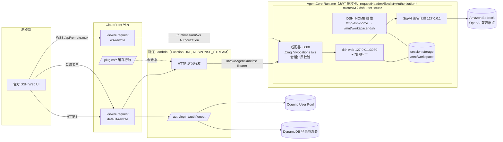

# Design Document

## Overview

本设计把 DeepSeek Harness（DSH）的官方 Web 界面 `dsh web` 运行在 Amazon Bedrock AgentCore Runtime 上，每名用户对应一个运行时会话（用户运行时会话）。浏览器经过一条隧道访问该会话里的 DSH_Web。隧道由 CloudFront、两个 CloudFront Function、一个隧道 Lambda 以及 microVM 内的适配器组成。

PoC 不自建前端，也不自建历史存储或工作空间存储。会话历史、工作空间、停止生成、文件预览都直接使用 DSH 自己的实现；数据落在 AgentCore 的托管 session storage 上。PoC 自己的代码只做四件事：
- 协议转换：浏览器 HTTP/WebSocket ↔ AgentCore `/invocations` 与 `/ws`；
- 身份：登录、令牌、用户到会话的映射，以及会话归属校验；
- DSH 托管：启动与加固，DSH 数据目录的持久化；
- 模型接入：SigV4 签名。

本设计取代此前「自建 SPA + 接入服务 + DynamoDB 历史 + S3 工作空间版本存储」的方案。改变方案的原因有两个：用户要求必须使用 AgentCore，并且不自建 UI；Spike 06 证明官方 UI 可以经隧道运行在 AgentCore 上（本机 23/23、AgentCore 18/18、CloudFront + Cognito 22/22）。Spike 07 在 AgentCore 上用真实 Bedrock DeepSeek 模型跑通了对话、工具调用、停止生成与错误显示（本机 27/27、AgentCore 20/20）。Spike 08 验证了 IaC 下 Runtime 的版本与数据清空语义，以及部署失败语义。Spike 09 验证了长连接、microVM 回收与令牌过期下官方 UI 的行为，并发现和修复了 AgentCore `/ws` 单帧 64 KB 上限的问题。Spike 01–05 的结论中仍然有效的部分已并入本文，其余不再适用。

> 术语澄清：AWS 文档中的 "AgentCore harness" 是 AWS 自己的托管编排层，与本 PoC 部署的 DeepSeek Harness 同名不同物。本设计只使用 AgentCore Runtime。

### 关键决策

| 决策点 | 选定方案 | 主要理由 | 未选方案 |
|---|---|---|---|
| 前端 | 官方 `dsh web`（`@deepseek-ai/dsh@0.1.5-rc.3`），不改前端代码，用加固补丁关闭不适合托管的功能 | 用户要求；得到完整的官方交互（计划、子代理、附件、文件预览等）；Spike 06 已跑通 | 自建 SPA（用户否决）；只在 microVM 外反向代理（DSH 是单用户进程，没有多用户隔离） |
| 用户与会话映射 | 一名用户对应一个 runtimeSessionId：`dsh-user-<Cognito sub>`（45 个字符，满足 AgentCore 至少 33 个字符的要求） | 一名用户的全部 DSH 会话都放在同一个 microVM 和同一份持久目录里，DSH 自己的会话列表就是这名用户的会话列表 | 一个 DSH 会话对应一个运行时会话（与 DSH_Web 的多会话模型冲突）；每名用户一个 Runtime（资源数随用户数增长，作为存储退路保留，见下） |
| 持久化 | AgentCore 托管 session storage 挂在 `/mnt/workspace`，`HOME` 指向它，工作空间为 `~/workspace`。`DSH_HOME` 放在本地 `/tmp/dsh-home`，由适配器每 2 s 镜像到 `/mnt/workspace/.dsh` | 按会话隔离、免 VPC、stop/resume 后仍保留（Spike 06 实测）。session storage 不支持硬链接，而 DSH 用 `link()` 发布会话文件，所以 DSH_HOME 不能直接放在上面 | 每名用户一个 Runtime + EFS 访问点（需要 VPC；不会因 Runtime 版本更新而清空，作为退路）；Instances 计算类型 + 每会话 EBS 卷（未验证） |
| 承载方式 | AgentCore Runtime 直接代码部署（`NODE_22`，linux/arm64 zip），HTTP 协议 | Spike 06 实测可行：包 58 MB，解压 275 MB，低于 250 MB 压缩包上限；不需要 ECR 与镜像构建 | 自带容器镜像（仍可行；需要 tini 等 init 时再切换，见风险表） |
| 入口鉴权 | Cognito User Pool + Runtime 的 `customJWTAuthorizer`（`allowedClients`）。Runtime 用 `requestHeaderAllowlist=Authorization` 把令牌转给适配器，由适配器校验会话归属 | JWT 授权器只验证令牌本身，不绑定会话 ID（AgentCore 文档与 Spike 06 C07 均确认），所以必须在容器内再校验一次 | IAM SigV4（终端用户没有 IAM 身份） |
| 浏览器 → AgentCore（HTTP） | CloudFront 默认行为 → 隧道 Lambda（Function URL，`AuthType NONE`，`RESPONSE_STREAM`，只接受带源站密钥头的请求）→ `InvokeAgentRuntime`（Bearer） | 官方 UI 使用根路径下的任意 HTTP 请求，而 AgentCore 只有 `/invocations`，必须有一层把请求封包；Lambda 同时承担登录 | OAC 签名的 Function URL（DSH 客户端不会发送 `x-amz-content-sha256`，POST 请求会被拒绝）；浏览器直连 AgentCore（无法携带 Bearer） |
| 浏览器 → AgentCore（WebSocket） | CloudFront `/api/remote.mux` 行为直接以 AgentCore 数据面为源；viewer-request 函数把 cookie 中的令牌放进 `Authorization`，把 URI 改写为 `/runtimes/<arn>/ws`，会话 ID 放在查询参数中 | 官方 UI 的 WebSocket 固定连接 `location.origin/api/remote.mux`，既不能设置子协议也不能设置请求头；Lambda 不能承载 WebSocket | API Gateway WebSocket（需要自己实现帧转发和连接状态）；让 Lambda 承载 WebSocket（不支持） |
| 登录 | 隧道 Lambda 提供最小的登录页，用 `AdminInitiateAuth`（`ADMIN_USER_PASSWORD_AUTH`）换取访问令牌，写入 `HttpOnly; Secure; SameSite=Lax` cookie。失败计数与锁定存放在 DynamoDB（Spike 01 结论） | 口令哈希与令牌签名由 Cognito 托管；统一失败提示、锁定策略、输入校验都由自有代码控制 | Cognito Hosted UI / Managed Login（锁定策略与失败提示不可控，Spike 01）；触发器计数（PostAuthentication 在口令错误时不触发） |
| 模型接入 | 默认模型为 `deepseek.v3.2`，走 `bedrock-runtime` 端点面：DSH 的 `llm-pi-ai` `openai-completions` 路由 → 适配器内的 127.0.0.1 SigV4 签名代理（使用执行角色的临时凭证）→ Bedrock OpenAI 兼容端点。签名代理同时剥离 V3.2 漏出的原始工具调用标记（Spike 05、07） | DSH 没有逐请求签名的钩子；执行角色凭证自动轮换，不存在长期密钥；`bedrock-runtime` 可以把 IAM 权限限定到单个模型（Spike 07） | R1（OpenAI 兼容端点不支持，Spike 07 实测 404）；`bedrock-mantle` 上的 V3.1（不漏标记，但只能按项目授权、不能限定到模型，而且是较旧的版本；保留为配置项）；Bedrock API key（需要保管密钥）；LiteLLM 等代理网关（多一层部署） |
| 部署栈 | AWS CDK v2（TypeScript）。`AWS::BedrockAgentCore::Runtime` 的 `FilesystemConfigurations`、`RequestHeaderConfiguration`、`AuthorizerConfiguration` 均为 CloudFormation 原生属性，更新都是 No interruption | 与其余代码同语言；`cdk deploy/destroy` 直接对应 1.2/1.3/1.9 | Terraform（AgentCore 资源覆盖滞后） |

### 需求中的量化约束落点

| 约束 | 来源 | 设计落点 |
|---|---|---|
| 部署 ≤ 60 分钟，卸载 ≤ 30 分钟 | 1.2、1.9 | 耗时最长的是 CloudFront 分发的创建与删除，Spike 06 实测约 5–15 分钟；Runtime 创建与更新约 1–3 分钟 |
| 冷启动 ≤ 60 秒 | 1.11、5.3 | Spike 06 实测：新会话 7.9–11.4 s，stop 之后恢复 10.6 s；任务 8.2 实测 stop 之后「登录 → 首页可用」16.6 s，其中适配器启动到 DSH 就绪 4.7 s。适配器挂起请求直到 DSH 就绪，最多等待 90 s |
| 登录 ≤ 2 秒 | 2.2 | 1 次 DynamoDB 读 + 1 次 `AdminInitiateAuth`（Spike 01 实测服务端处理 154–478 ms）。登录响应只写 cookie 并返回 303，不等待 microVM |
| 失败 5 次 / 5 分钟 → 锁定 15 分钟 | 2.5 | 登录处理内调用纯函数 `evaluateThrottle`，失败时间戳与 `lockedUntil` 存放在 DynamoDB `THROTTLE#<sha256(小写用户名)>` 项（TTL 1 天）；锁定期内不调用 Cognito |
| 令牌有效期 12 小时 | 2.7 | App Client `accessTokenValidity = 12h`（参数 `tokenValidityHours`）；cookie `Max-Age` 取 `ExpiresIn`。隧道 Lambda 在令牌快过期时用刷新令牌续期（刷新令牌有效期 `refreshTokenValidityDays`） |
| 首页加载 ≤ 15 秒（热会话） | 3.2 | Spike 06 实测经 CloudFront 为 4.3–5.9 s（页面加载）；任务 8 实测「登录提交 → 输入框可用」8.4–11.3 s。最大的一项是压缩后 4.2 MB 的插件包；可缓存的 `/plugins/*` 行为见第 2 节 |
| 停止生成 ≤ 2 秒 | 3.6 | DSH 自带的停止功能经 WebSocket 传递。实测：本机 64 ms，AgentCore 519 ms，CloudFront 568–741 ms |
| WebSocket 空闲 ≥ 180 秒 | 3.8 | AgentCore `/ws` 空闲约 60 s 会断开（1006）；适配器每 20 s（`wsKeepaliveMs`）向 AgentCore 一侧发送 ping。Spike 06 实测 180 s 不断；Spike 09 在 EC2 上实测保持到 AgentCore 的 1 小时连接上限（之后页面自动重连）。发往 AgentCore 的消息按 `wsFrameMax` 分片，避开单帧 64 KB 上限 |
| 回收前至少 5 秒写入的数据可见 | 5.3 | DSH_HOME 每 2 s 镜像一次，SIGTERM 时再做一次最终同步。工作空间直接写在 session storage 上，AgentCore 在会话期间持续复制 |

## Architecture

### 系统架构图



### 三条请求路径

**页面与 API（HTTP）**
1. 浏览器请求任意路径，例如 `/`、`/plugins/??a,b&rev=x`、`/api/session/list`。
2. CloudFront 默认行为上的 `default-rewrite` 函数：如果查询串中有以 `?` 开头的键，就把原始查询串搬进 `x-dsh-raw-query` 头，并清空查询串。原因是 Lambda Function URL 会直接以 400 拒绝这种查询串。
3. 隧道 Lambda 依次处理：
   - 校验源站密钥头 `X-Origin-Verify`；
   - 从 cookie `dsh_token` 取出令牌，解码出 `sub`，派生会话 ID；
   - 把请求封包成 `{v,method,path,headers,body(b64)}`；
   - 以 `Authorization: Bearer <令牌>` 和 `X-Amzn-Bedrock-AgentCore-Runtime-Session-Id` 调用 `InvokeAgentRuntime`。
4. AgentCore 的 JWT 授权器验签，然后把请求路由到该会话的 microVM（没有就新建）。
5. 适配器依次处理：
   - 核对会话 ID 等于 `dsh-user-<JWT.sub>`；
   - 拆开封包，去掉 `cookie`、`authorization`、`x-amz*` 等请求头，换上自己持有的 DSH cookie；
   - 把 Host 改写为 `127.0.0.1:3080`，转发给 DSH_Web；
   - 把响应写成「一行元数据 JSON + 原始字节」流式返回。
6. Lambda 拆出元数据行，用其中的状态码、响应头和 cookie 构造响应，把其余字节原样流回浏览器。

**WebSocket（`/api/remote.mux`）**
1. `ws-rewrite` 函数执行以下动作：
   - 取出 cookie `dsh_token`；没有则返回 401；
   - 解码 `sub`，要求它符合 UUID 形态；
   - 设置 `Authorization: Bearer <令牌>`，删除 `Cookie` 与 `Origin`；
   - URI 改为 `/runtimes/<URL 编码的 ARN>/ws`，查询串改为 `qualifier=DEFAULT&X-Amzn-Bedrock-AgentCore-Runtime-Session-Id=dsh-user-<sub>`。
2. 该行为的源是 `bedrock-agentcore.<region>.amazonaws.com`，缓存策略把 `Authorization` 与全部查询串放进缓存键。这样做是为了让 CloudFront 把它们转发给源站，TTL 设为 0。
3. 适配器在升级前核对会话归属，然后与 DSH_Web 的 `/api/remote.mux` 建立连接，双向转发帧，并每 20 s 向 AgentCore 一侧发送 ping。

**登录与登出**
- 登录：`GET /auth/login` 返回最小的 HTML 表单。`POST /auth/login` 依次做输入校验、节流判定、`AdminInitiateAuth`，成功后返回 303 跳到 `/` 并下发 `Set-Cookie: dsh_token=…`。
- 登出：`GET /auth/logout` 调用 `AdminUserGlobalSignOut`，使刷新令牌失效，然后清除 cookie 并跳转到登录页。已签发的访问令牌在过期前仍能通过 AgentCore 的 JWT 授权器（见风险表）。

### 职责边界与安全分层

| 层 | 挡住什么 | 依据 |
|---|---|---|
| CloudFront + 源站密钥头 | 绕过 CloudFront 直连 Function URL（返回 403） | Spike 06 C03 |
| 隧道 Lambda / CloudFront Function | 未登录请求：HTTP 返回 401，页面导航 303 跳到登录页，WebSocket 返回 401；浏览器无法指定会话 ID | C01、C04、C05 |
| AgentCore JWT 授权器 | 无令牌、令牌被篡改、令牌过期、`client_id` 不在 `allowedClients` 中 | C09、C10、C13 |
| 适配器会话归属校验 | 持有有效令牌、却直接调用 AgentCore 访问他人会话 ID | C07（`/invocations` 内层 403）、C11（`/ws` 被拒绝） |
| AgentCore microVM + session storage | 进程、内存、文件系统按会话隔离，session storage 只能被本会话访问 | AgentCore 文档；U10 |
| 执行角色最小权限 | microVM 内的工具进程能拿到执行角色凭证，但只能调用所选模型和写日志 | Spike 03 结论：执行角色凭证不带会话标签，microVM 内所有进程都能拿到 |
| 加固补丁 | 浏览器修改设置、凭证、模型、插件；遥测与 DeepSeek 外联 | Spike 06 L04、L10、L11、A05 |

适配器剥离 `authorization`、`cookie`、`x-amz*` 等请求头后，才把请求转发给 DSH，因此用户令牌不会进入 DSH 进程，也不会进入会话日志。

## Components and Interfaces

### 1. 适配器（`services/adapter`，microVM 内）

入口 `app.js`（直接代码部署的 `entryPoint`）。它监听 `0.0.0.0:8080`，是 microVM 内唯一对外的进程。

| 接口 | 行为 |
|---|---|
| `GET /ping` | DSH 就绪前返回 `{"status":"HealthyBusy"}`，就绪后返回 `Healthy` |
| `POST /invocations` | 请求体是一个请求封包。先做会话归属校验，失败时返回 200 + 内层 403（外层 200 让 AgentCore 不把它当成容器故障）。DSH 未就绪时挂起请求，最多 `dshReadyTimeoutMs`（90 s），超时返回内层 503。然后转发给 `127.0.0.1:DSH_PORT`，流式写回「元数据行 + 原始字节」。调用方断开时中止发往 DSH 的请求 |
| `GET /ws`（升级） | 会话归属校验失败时返回 `403`，AgentCore 会把它变成 424 返回给调用方。校验通过后：<br/>- 与 DSH 的 `/api/remote.mux` 建立连接，双向转发帧；DSH 未连上前收到的帧先缓存。<br/>- 每 `wsKeepaliveMs` 向客户端一侧发送 ping。<br/>- **发往 AgentCore 一侧的消息超过 `wsFrameMax`（48 KB）时，拆成 RFC 6455 续帧发送**（见下文「64 KB 帧上限」）。<br/>- 任一侧关闭时两侧一起关闭（1005/1006 映射为 1011），并输出 `ws closed` 日志，字段为：哪一侧先关闭、关闭码、原因、连接时长、两个方向的帧数。 |

**封包格式（`packages/envelope`）**
- 请求：JSON `{v:1, method, path, headers, body}`。`path` 包含原始查询串，`body` 为 base64 或 null。
- 响应：第一行是 `{v:1, status, headers}` 加 `\n`，其后是原始响应体字节。`headers` 中 `set-cookie` 以数组形式保留。

**请求头过滤（纯函数 `toDshHeaders` / `fromDshHeaders`）**
- 发往 DSH 时丢弃：逐跳头、`origin`、`sec-fetch-*`、`cookie`、`authorization`、`x-amz*`、`x-amzn-*`；换上适配器持有的 DSH cookie，Host 改写为 `127.0.0.1:DSH_PORT`。
- 返回给浏览器时：丢弃逐跳头，并丢弃 DSH 下发的 `set-cookie`（浏览器不需要 DSH 的 cookie），其余原样返回。

**会话归属校验（纯函数 `sessionOwnerRejection(headers)`）**
- 要求 `authorization` 为 `Bearer <三段 base64url>`，解码 payload 取出 `sub`，并要求会话 ID 等于 `dsh-user-<sub>`。
- 这里只解码、不验签：签名已由 AgentCore 验证，而且未验签的令牌到不了容器。
- `/ws` 上 AgentCore 转发请求头时区分大小写，只有写成 `Authorization` 的头会被转发（Spike 06 C15）。CloudFront Function 必须按这个大小写设置该头，直连调用方也一样。

**DSH 启动与就绪**
1. 从持久目录恢复 DSH_HOME：把 `/mnt/workspace/.dsh` 复制到 `/tmp/dsh-home`，排除 `profiles/`。
2. 以子进程方式启动 `dsh web --host 127.0.0.1 --port 3080 --patch dsh/web.cordis.yml --patch dsh/web-hardening.cordis.yml`。环境变量：`HOME=/mnt/workspace`、`DSH_HOME=/tmp/dsh-home`、`DSH_TELEMETRY_DISABLED=1`。
3. 从 DSH 输出中取得一次性 token，用它换取 HMAC cookie 并保存在内存中。然后把 `/ping` 置为 `Healthy`，放行挂起的请求。
4. 启动 DSH_HOME 镜像：每 2 s 做一次增量复制（按 mtime + size 判断），排除 `profiles/`。收到 SIGTERM 时，先向 DSH 发送 SIGTERM，等待 1.5 s 后做最后一次同步，然后退出。

**SigV4 签名代理**：监听 127.0.0.1 的随机端口，负责以下几件事：
- 丢弃 DSH 发来的占位 `Authorization`，用执行角色的临时凭证按 `MODEL_SIGNING_SERVICE`（`bedrock` 或 `bedrock-mantle`）和 `MODEL_REGION` 重新签名（含 `x-amz-content-sha256`）。
- 把 DSH 请求路径中的 `/openai/v1` 前缀映射到 `MODEL_BASE_URL` 的路径上，然后转发。
- 把 SSE 响应逐帧流回，同时执行原始标记过滤（见「5. 模型接入」）。
- DSH 断开连接时，同时中止上游请求（Spike 05 D07；Spike 07 在 AgentCore 上实测停止生成时取消了 1 次）。
- 每次调用输出一条 `model call` 日志，字段为：状态码、耗时、是否被取消、剥离次数、错误响应摘要。

**64 KB 帧上限与分片（Spike 09）**
- 现象：AgentCore `/ws` 对**单个 WebSocket 帧**限制 64 KB，两个方向都一样。超限时 AgentCore 以 1009「message size limit of 64 KB for a message frame is exceeded」关闭连接。限制作用于帧而不是消息：70 KB 的消息拆成两个续帧可以通过，单帧 70 KB 会被拒绝（`big-frame.json`）。
- 影响：会话历史稍长时，刷新页面后 DSH 一次推送的历史快照超过 64 KB（实测 72 KB）。连接会反复被关闭，界面显示「历史加载失败：Remote stream WebSocket closed」。
- 处理：适配器发往 AgentCore 一侧的消息超过 `wsFrameMax` 时，按续帧拆开发送（纯函数 `fragment(buf, max)`，Property 11）。加上分片后，同一场景恢复正常（S03）。
- 另一个方向（浏览器 → AgentCore）无法分片：浏览器的 WebSocket API 总是单帧发送。好在 DSH 的提示词走 HTTP `POST /api/session/prompt`，WebSocket 上行只有小的控制消息，这一方向列为残余风险。

**会话回收与重连（Spike 09）**
- 适用情形：`StopRuntimeSession`、`maxLifetime` 到期、空闲回收。
- 行为：打开着的页面 WebSocket 断开后，DSH_Web 显示「自动重连中…」，约 1 s 内重新连接；新的 microVM 冷启动期间，连接请求会被挂起。
- 结果：不刷新页面可以直接继续对话；刷新后历史仍在。
- WebSocket 上有流量（包括适配器每 20 s 的 ping）时，会话不被当作空闲：在 EC2 上只保持 WebSocket、不发任何 HTTP 调用，会话一直存活到 60 分钟，远超 900 s 的空闲超时。
- **AgentCore 对每条 WebSocket 有 1 小时的连接时长上限**：到时以 1008「Max connection duration of 1 hour is exceeded」关闭。经 CloudFront 与直连都一样（EC2 实测 3626–3632 s）。
  - 页面会像回收时一样自动重连。浏览器中对 1008 的重连行为尚未单独验证，列入任务 8.2。
  - 重连握手需要一个有效的访问令牌，这也是访问令牌有效期保持 12 h 的原因：cookie 中的令牌只有在 HTTP 请求经过隧道 Lambda 时才会续期，而用户长时间不操作时不会有 HTTP 请求。

**环境变量**：`PORT`、`DSH_PORT`、`USER_HOME`、`DSH_PATCHES`、`DSH_HOME_MIRROR`、`REQUIRE_SESSION_OWNER`（生产为 `1`）、`WS_KEEPALIVE_MS`、`WS_FRAME_MAX`（默认 49152）、`MODEL_ID`、`MODEL_REGION`、`MODEL_BASE_URL`（端点面的完整 OpenAI 兼容 base URL）、`MODEL_SIGNING_SERVICE`、`MODEL_STRIP_RAW_TOOL_MARKUP`（默认开启），以及只在测试中使用的 `MOCK_MODEL`。

### 2. CloudFront 分发与函数（`services/edge`）

| 行为 | 源 | 缓存策略 / 源请求策略 | 函数 |
|---|---|---|---|
| 默认 `*` | 隧道 Function URL，自定义头 `X-Origin-Verify: <密钥>`，`OriginReadTimeout` 60 s | `CachingDisabled` / `AllViewerExceptHostHeader`；允许全部 7 种方法 | `default-rewrite` |
| `/api/remote.mux` | `bedrock-agentcore.<region>.amazonaws.com` | 自定义：`Authorization` 与全部查询串进入缓存键，TTL 0/0/1 / `AllViewerExceptHostHeader`；只允许 GET、HEAD | `ws-rewrite` |
| `/plugins/*`（优化项，任务 6.3） | 隧道 Function URL | 自定义：缓存键包含路径、`x-dsh-raw-query` 与全部查询串，不含 cookie；TTL 0/1 天/1 天，遵从源站 `Cache-Control` / `AllViewerExceptHostHeader`；响应头策略删除 `Set-Cookie`；只允许 GET、HEAD | `default-rewrite`，并要求请求带有 `dsh_token` cookie（只检查是否存在） |

`/plugins/*` 缓存的是 DSH npm 包内的客户端代码：它与用户无关，URL 中带有内容哈希 `rev`，而且加固补丁对所有用户相同。带 `rev` 的插件包 DSH 返回 `public, max-age=31536000, immutable`，错误响应是 `no-store`，因此只有成功的插件包会被缓存。缓存未命中时，请求仍会经过 Lambda 和完整的鉴权链。
共享缓存的响应绝不能带 `Set-Cookie`，否则一个用户的令牌会被缓存给其他用户。所以隧道 Lambda 对 `/plugins/*` 不做滑动续期、不透传 DSH 的 `Set-Cookie`，CloudFront 的响应头策略再删一次。

分发的错误缓存 TTL 对 400/403/404/500/502/503/504 设为 0（默认 10 s），避免冷启动期间的 502 等错误被缓存；401 本来就不缓存。

**函数约束**（`cloudfront-js-2.0`）：
- base64 解码使用 `Buffer`。手写循环会超出指令上限（Spike 06 实测）。
- `querystring` 对象的键顺序与原始 URL 不一致。重组查询串时，要先放以 `?` 开头的键，再放其余键。
- 函数只解码令牌、不验签，不能作为安全边界。验签由 AgentCore 负责。

### 3. 隧道 Lambda（`services/tunnel`）

Node.js 22，arm64，超时 900 s，内存 512 MB，Function URL `AuthType NONE` + `RESPONSE_STREAM`。

| 路由 | 行为 |
|---|---|
| 任意路径，但 `X-Origin-Verify` 不匹配 | 403 |
| `GET /auth/login` | 登录页 HTML：可访问的 label、`autocomplete`、`role="alert"` 错误区域 |
| `POST /auth/login` | 1. 输入校验：用户名或口令为空、用户名超过 64 个码位、口令超过 128 个码位 → 统一失败，不调用 Cognito。<br/>2. 读取 `THROTTLE#` 项；处于锁定期 → 统一失败。<br/>3. 调用 `AdminInitiateAuth`。<br/>4. 失败时追加失败时间戳，由 `evaluateThrottle` 计算 `lockedUntil`，然后返回统一失败（401 + 登录页）。<br/>5. 成功时返回 303 `/`，下发两个 cookie：`dsh_token`（访问令牌，`Path=/`）与 `dsh_refresh`（刷新令牌，`HttpOnly; Secure; SameSite=Strict; Path=/`）。 |
| `GET /auth/logout` | `AdminUserGlobalSignOut`（失败时只记录日志）→ 清除两个 cookie → 303 `/auth/login` |
| 其他路径，没有 cookie | `GET /` 或 `/index.html` → 303 `/auth/login`；其他 → 401 |
| 其他路径，有 cookie | 1. **滑动续期**：访问令牌已过期或剩余不足 `tokenRefreshSkewSeconds`（默认 300）时，先用 `dsh_refresh` 调用 `InitiateAuth`（`REFRESH_TOKEN_AUTH`）换一个新令牌，本次响应附带新的 `Set-Cookie: dsh_token`。刷新失败（已登出、刷新令牌过期）时按「令牌无效」处理。`/plugins/*` 例外：不续期，也不透传任何 `Set-Cookie`（共享缓存，见第 2 节）。<br/>2. 封包并调用 `InvokeAgentRuntime`：<br/>- AgentCore 返回 409（会话正忙）：按 200/400/800 ms 退避重试 3 次。<br/>- AgentCore 返回 401/403：页面导航清除 cookie 并跳到登录页，其余请求原样返回该状态码。<br/>- AgentCore 返回其他非 200 状态：502 `agentcore <status>`。<br/>- 返回 200：拆出元数据行后流式透传。 |

**为什么要滑动续期（Spike 09 T 阶段）**：
- 已建立的 WebSocket 在令牌过期后仍然可用：AgentCore 只在握手时验证 JWT，连接又保持了 9 分钟。
- 但 DSH_Web 发送消息走的是 HTTP `POST /api/session/prompt`。令牌一过期，这个请求就返回 401，界面**没有任何提示**，消息像是发出去了但没有回复；只有刷新页面才会跳转到登录页。
- 在 Lambda 里续期，可以让令牌在用户活跃期间一直有效。刷新令牌的有效期（`refreshTokenValidityDays`，默认 1 天）才是真正的登录时长。
- WebSocket 重连（CloudFront Function 注入 cookie 中的令牌）用的是最近一次 HTTP 响应更新过的 cookie。

**响应流写法**：`HttpResponseStream.from()` 之后至少要调用一次 `write`，空响应体也要写一次空 Buffer。否则状态码与响应头发不出去，Function URL 会回退为 `200 application/octet-stream`（Spike 06 实测）。另外，`from()` 之后不能直接 `end(body)`，那样会得到 502（Spike 04）。

**请求头**：去掉 `x-amz*`、`x-forwarded-*`、`cloudfront-*`、`x-origin-verify`、`x-dsh-raw-query` 与逐跳头，其余放进封包。`x-dsh-raw-query` 解码后拼回 `path`。

**封包带来的体积上限**：Function URL 的请求体上限为 6 MB，而封包用 base64，体积增加约 33%，因此单个上传请求的原始体积不能超过约 4.4 MB。DSH 的附件上传受这个限制，已写入已知限制。

### 4. DSH 配置与加固（`services/adapter/dsh/`）

- `web.cordis.yml` 做两件事：
  - 把 `llm-pi-ai` 的 `openai-completions` 路由指向签名代理：`baseURL` 为 `http://127.0.0.1:<port>/openai/v1`，API key 为占位值，模型为 `MODEL_ID`。
  - 把默认工作区设为 `~/workspace`。
- `web.cordis.yml` 还把 `web-search-deepseek` 的 `baseURL` 指向适配器内的 DeepSeek 代理，`apiKeyEnv` 指向占位变量 `DSH_BRIDGE_DEEPSEEK_KEY`。部署配置了 key 时适配器才设置这个变量，插件页的网页搜索卡片据此显示「已配置密钥」且输入框禁用；未配置时显示「未配置密钥」。
- `web.cordis.yml` 关闭：遥测、`session-title-llm`、`hmr`、`client-hmr`；`llm-deepseek` 与 DeepSeek 专用扩展行（`deepseek-llm-api-extensions`、`session-log-deepseek`、`plugin-package-inventory-deepseek`）；`open-in-app`。
- `web-hardening.cordis.yml` 只关闭 `ui-settings-models`（模型设置页）。插件设置页（`ui-settings-plugins`、`ui-settings-plugin-inventory`、`plugin-inventory`）与它依赖的 `settings-controller` 开放。
- 以下两类关不掉，原因已写明：
  - `ui-settings` / `ui-settings-general`：它们提供 `settingsScope`，有 30 个客户端插件依赖。
  - `web` 行：标准预设中的 `tool-web` 依赖它。
- **设置与凭证 RPC 的服务端过滤**（`services/adapter/src/rpc-guard.ts`）。`settings-controller` 对 `settings.update/replace/mutate` 不限制命名空间，并且总是挂载 `credentials.*`；DSH 没有按命名空间锁定的配置项，用户设置总是覆盖补丁里的值。浏览器的这些调用都是 `POST /api/<ns>/<method>`，适配器在转发前检查：
  - 放行 `settings/describe`、`settings/canOpenAgentPresetDirectory`、`credentials/describe`；
  - 写入只放行插件卡片（`shell`、`agent-loop`、`subagent-model-selection`、`web-search-deepseek`）、通用设置与界面偏好（`ui-theme`、`locale`、`ui-onboarding`、`ui-conversation`、`ui-chat`）、默认预设与默认模型选择（`agent-presets`、`permission`、`agent-default-model`）；`web-search-deepseek` 的 `apiKey`、`apiKeyEnv`、`baseURL` 不可写；
  - 拒绝 `llm-pi-ai` 等其余命名空间、`credentials/set|unset`、`settings/open*`、路径与请求体 `method` 不一致的请求。拒绝时返回与 DSH 网关同形的 RPC 失败（`deployment/locked`），界面显示「本部署没有接受这些值」。
  - 这是防误用的边界，不是安全边界：用户可以在 bash 中直接修改 `$DSH_HOME/settings.yaml`（DSH 会热加载）。
- **页面注入传输钩子**（`services/adapter/src/html-inject.ts`）。DSH 客户端只在页面地址是回环地址、或页面声明独占 Host（官方的 `__DSH_TRANSPORT__.ownsHost`）时，才把设置读写到主机（`ctx.remote.$host.isLoopback`）；否则设置面板只在浏览器内存中生效，插件卡片为空（真实部署实测）。经 CloudFront 访问时页面地址不是回环地址，所以适配器在 HTML 响应的 `<head>` 最前面注入 `globalThis.__DSH_TRANSPORT__={fetch:(i,n)=>globalThis.fetch(i,n),ownsHost:true}`：每个用户独占一个 microVM，且 DSH 只能经适配器访问，这个声明成立。为此适配器对 `Accept: text/html` 的 GET 请求去掉 `Accept-Encoding`，拿到未压缩的 HTML 再注入。服务端不受影响（适配器把 Host 改写为 127.0.0.1，DSH 本来就视为本机请求）。附带效果：通用设置（主题、语言等）也改为保存在主机，「打开配置文件」按钮出现，但点击会被设置过滤拒绝（它在 microVM 里打开本机编辑器，没有意义）。本机集成测试用 `*.test` 主机名（浏览器内映射到 127.0.0.1）复现非回环地址。
- **DeepSeek API key**（网页搜索用）：
  - 部署时经环境变量 `DEEPSEEK_API_KEY` 传入，`deploy` 包装器在部署成功后写入栈中的 secret（`DeepSeekApiKeySecretArn`）。CDK context 中出现 key 会被拒绝；模板里的 secret 只有占位值 `not-configured`。
  - Runtime 的环境变量只有 secret 的 ARN（`DEEPSEEK_KEY_SECRET_ARN`），执行角色可读该 secret。设置或轮换 key 不改动 Runtime，不产生新版本，不清空数据。
  - 适配器的 DeepSeek 代理（`deepseek-proxy.ts`）只放行 `POST /anthropic/v1/messages`，替换占位的 `x-api-key` / `Authorization`；key 缓存 5 分钟，上游 401 时重读一次。卡片的「已配置密钥」状态在 microVM 启动时确定。
  - 局限：拥有 bash 的用户仍可以直接调用 127.0.0.1 上的代理，或用执行角色凭证读取 secret，从而使用或取得这个 key。它是整个部署共享的 key，适合 PoC；长期使用需要按用户的 key 或在 microVM 之外注入。
- 构建时对补丁组合执行一次 `dsh ... --dump-config` 做校验，确保补丁中的行 id 在锁定版本里都存在。

DSH 版本锁定为 `@deepseek-ai/dsh@0.1.5-rc.3`（tag `dsh-v0.1.5-rc.3`，commit `a4c74a91e06b00fe0b0937bde982170c526cc842`），`package-lock.json` 锁定全部依赖。升级前必须重跑本机、AgentCore、CloudFront 三组集成用例。

### 5. 模型接入

**两个模型来源**（任务 11，用户选择方案 B）：

| 来源 | DSH 插件 | 路径 | 凭证 | 模型 |
|---|---|---|---|---|
| DeepSeek 官方（配置了 key 时为默认） | `llm-deepseek`（DSH 自带） | DSH → 适配器 DeepSeek 代理 → `https://api.deepseek.com`（`POST /chat/completions`、Files API） | 代理注入部署配置的 key（Secrets Manager） | `deepseek-flash`（DeepSeek-V4.1-Flash，默认）、`deepseek-v4-pro` |
| Amazon Bedrock | `llm-pi-ai` 的 `bedrock` 提供方 | DSH → SigV4 签名代理 → `bedrock-runtime` | 执行角色临时凭证 | `deepseek.v3.2`（下文） |

- 模型列表写在补丁里，只列出部署所用 key 实际可用的两个（`GET https://api.deepseek.com/models`，2026-09-28）；DSH 默认目录里的 `deepseek-v4-flash`、`deepseek-v4-flash-vision-exp` 该 key 不可用，未列出。
- 没有配置 key 时 `llm-deepseek` 整行关闭（`disabled: !!js process.env.DSH_BRIDGE_DEEPSEEK_KEY === undefined`），模型下拉里只有 Bedrock。
- 默认模型由适配器按「key 是否已配置」在 microVM 启动时决定（`DSH_BRIDGE_DEFAULT_PROVIDER/MODEL`；适配器环境变量 `DEFAULT_MODEL=bedrock` 可强制 Bedrock，本机集成测试的阶段 B、F 用它覆盖 Bedrock 路径）。用户在输入框的模型下拉里做的选择会保存为该用户之后新会话的默认值。
- DeepSeek 官方调用的内容离开 AWS，费用计入该 key 所属的 DeepSeek 账户，所有用户共用。
- 同一会话中途切换来源：实测多数情况下正常，但出现过一次 Bedrock `deepseek.v3.2` 在接续 DeepSeek-V4.1-Flash 的历史后输出乱码（U15 记录）。建议在新会话中切换。
- 下文的原始工具调用标记过滤只作用于 Bedrock 路径；DeepSeek 官方 API 返回结构化的 `tool_calls`，端到端用例（R03，展开后检查）未发现原始标记。

**Bedrock 路径**

Spike 07 在 us-east-1 用真实 Bedrock 验证了本节，本机 27/27、AgentCore 20/20，详见 `spikes/07-bedrock-model/README.md`。

**模型与端点面**

| 端点面 | Base URL | SigV4 服务名 | 可用的 DeepSeek 模型 | 执行角色所需权限（受限角色逐项实测） |
|---|---|---|---|---|
| `bedrock-runtime`（默认） | `https://bedrock-runtime.{region}.amazonaws.com/openai/v1` | `bedrock` | 只有 `deepseek.v3.2`；R1 的两种 ID 都返回 404 `model_not_found` | `bedrock:InvokeModel`，资源为 `arn:aws:bedrock:{region}::foundation-model/deepseek.v3.2`。流式调用也只需要这个动作；只给 `InvokeModelWithResponseStream` 会被拒绝 |
| `bedrock-mantle` | `https://bedrock-mantle.{region}.api.aws/v1` | `bedrock-mantle` | `deepseek.v3.1`、`deepseek.v3.2` | `bedrock-mantle:CreateInference`，资源为 `arn:aws:bedrock-mantle:{region}:{account}:project/default`。按项目授权，不能限定到具体模型 |

`deepseek.v3.2` 在 us-east-1 按需调用即可，不需要推理配置。`modelId` 直接填基础模型 ID。

**请求与响应形态**
- 请求：DSH 的请求体（`model`、`messages`、`stream`、`stream_options.include_usage`、`store:false`、`max_completion_tokens`、23 个 function 工具）在两个端点面上都被原样接受，不需要 `compat` 开关，也不需要删除字段。
- 响应：
  - 标准 SSE，以 `data: [DONE]` 结束，末尾带 usage 片段。
  - 每个 choice 多一个 `obfuscation` 字段，DSH 会忽略它。
  - V3.2 默认不输出 `reasoning_content`。
- 工具调用：
  - `tool_calls` 在一个片段里整体到达（完整的 `arguments`），`finish_reason` 为 `tool_calls`。
  - 回填 `role:"tool"` 结果后能正常续答，多轮上下文正确（R03/R04）。

**原始工具调用标记过滤（必需）**
- 问题：`deepseek.v3.2` 在两个端点面上都会在返回结构化 `tool_calls` 的同时，把 `<｜DSML｜function_calls` 漏进 `delta.content`，12 次调用每次都出现。DSH 会把它当正文，展示在「N 次工具调用」折叠区里，并写入会话历史，后续轮次再把它发回模型。
- 处理：签名代理对 SSE 响应逐帧过滤（`MODEL_STRIP_RAW_TOOL_MARKUP`，默认开启）：
  - 某个 choice 的正文一旦出现 `<｜DSML｜`、`<｜tool▁calls▁begin｜>` 或 `<｜tool▁call▁begin｜>`，就丢弃标记及其后的正文；
  - 片段末尾可能是标记的前缀时，先扣住这一段，等下一个片段或 `finish_reason` 到达再决定放行还是丢弃；
  - 其他字段与帧数不变。
- 验证：
  - 过滤器按随机切块做了离线检查；
  - 开启后，界面与会话日志中都不再出现标记；
  - AgentCore 日志显示每轮工具调用剥离 1 次。
- 这是签名代理唯一解析 SSE 的地方，由 Property 10 覆盖。

**错误**
| 情形 | 上游返回 | DSH_Web 的显示 |
|---|---|---|
| 模型 ID 不存在 | 400 `validation_error` | 「本轮运行失败」+ 原始错误文本 |
| 执行角色无权调用 | runtime 端点面 401 `permission_denied_error`；mantle 端点面 403 `access_denied` | 「本轮运行失败 API 密钥无效 AUTH」（容易误导），真实原因只在适配器 `model call.errorBody` 中 |

以上所有情形页面都保持可用，会话历史不受影响。

**时延**（AgentCore，本机浏览器经网关）：文本回复 1.2–2.1 s，一轮工具调用 2.5–3.8 s，停止生成 504–531 ms。

### 6. 认证服务（Cognito）

- User Pool：用户名大小写不敏感，不开放自助注册，演示用户由部署栈创建，初始口令存放在 Secrets Manager。
- App Client：无 client secret；`explicitAuthFlows` 只包含 `ALLOW_ADMIN_USER_PASSWORD_AUTH` 与 `ALLOW_REFRESH_TOKEN_AUTH`；`PreventUserExistenceErrors=ENABLED`；访问令牌有效期取 `tokenValidityHours`，刷新令牌有效期取 `refreshTokenValidityDays`。
- Runtime 授权器：`discoveryUrl` 指向本 User Pool，`allowedClients` 只包含本 App Client。Cognito 访问令牌中没有 `aud` 声明，只有 `client_id`，所以用 `allowedClients` 而不是 `allowedAudience`（Spike 06 按此配置通过）。

## Data Models

### 持久目录布局（每个用户运行时会话一份）

```
/mnt/workspace/                 = HOME（session storage）
├── workspace/                  默认工作区：DSH 与工具在此读写，直接落在 session storage
└── .dsh/                       DSH_HOME 的镜像（由适配器写入，不含 profiles/）
    ├── sessions/…              DSH 会话日志（*.jsonl.zstd）
    ├── web/…                   Web 状态，含 cookie 签名密钥
    └── …
/tmp/dsh-home/                  DSH_HOME 的运行时副本（本地磁盘，支持硬链接）
```

session storage 的限制（AgentCore 文档；预览期，以官方文档为准）：
- 每会话 1 GB；元数据约 50 MB（约 10–20 万个文件）；目录深度 200 层；文件名 255 字节。
- 不支持硬链接、设备文件、FIFO、UNIX socket、xattr、fallocate。
- 会话 14 天未被调用时清空。
- **Runtime 版本更新后清空**：更新之后再调用该会话，会拿到一个全新的文件系统。
- 删除 Runtime 时一并删除。

以下场景会导致用户数据丢失，部署流程与 README 必须写明（需求 5.6）：Runtime 版本更新、14 天未使用、卸载。部署包装器会检测本次部署是否会产生新的 Runtime 版本（需求 1.8，见「部署栈」）。

### 登录节流项（DynamoDB `DshPocAuth` 表，按需计费）

| 属性 | 说明 |
|---|---|
| `pk` | `THROTTLE#<sha256(小写用户名)>` |
| `failures` | 近 5 分钟内的失败时间戳（毫秒），最多保留 5 个 |
| `lockedUntil` | 锁定截止时间（毫秒）或缺省 |
| `ttl` | 最近一次写入 + 1 天 |

写入时用条件表达式 `attribute_not_exists(pk) OR version = :v` 做乐观并发控制，冲突时重读并重试，最多 3 次。

### 结构化日志字段

- 隧道：`{t, level, msg, path, status, ms, sessionId, requestId}`。
- 适配器：`{t, level, msg, sessionId, method, path, status, ms}`，以及 `ws bridged/closed`、`session owner check failed{reason}`、`dsh ready{ms}`、`home restore{files,ms}`、`final home mirror sync{…}`。

两者的日志器都丢弃 `/token|password|secret|authorization|cookie/i` 形态的字段，路径只保留前 120 个字符。

## Correctness Properties

*属性是指在系统所有合法执行中都应成立的特征或行为，即对系统应当做什么的形式化陈述。属性是人类可读的规格说明与机器可验证的正确性保证之间的桥梁。*

### Property 1: 封包往返一致性
对任意 HTTP 方法、含任意字节的路径与查询串（含以 `?` 开头的查询串）、请求头集合与任意字节的请求体，`decodeRequest(encodeRequest(x))` 与 `x` 逐项相等。对任意状态码、响应头（含多值 `set-cookie`）与任意字节的响应体，无论按什么方式把字节流切成块，解析出的元数据与响应体都与编码前相等。
**Validates: Requirements 3.3**

### Property 2: 原始查询串重写保真
对任意由 CloudFront 解析出的查询串对象（键顺序任意，可含以 `?` 开头的键，值可为空或多值），`default-rewrite` 与 Lambda 还原逻辑组合后得到的查询串，与浏览器发出的原始查询串相等；不含以 `?` 开头的键时，请求保持不变。
**Validates: Requirements 3.3**

### Property 3: 会话归属判定
对任意令牌 payload 与会话 ID，`sessionOwnerRejection` 返回「放行」，当且仅当 `Authorization` 为形态正确的 Bearer JWT、payload 含 `sub`，且会话 ID 等于 `dsh-user-<sub>`。缺头、形态错误、payload 不可解析、`sub` 不一致，全部被拒绝。
**Validates: Requirements 2.10, 2.11, 4.1, 4.3**

### Property 4: 会话 ID 派生
对任意两个不同的 Cognito `sub`，派生的会话 ID 不同，长度不少于 33 个字符，且只包含 AgentCore 允许的字符。同一 `sub` 总是派生出同一 ID。
**Validates: Requirements 4.1**

### Property 5: 转发请求头过滤
对任意请求头集合，`toDshHeaders` 的输出不含 `authorization`、`cookie`、`origin`、`x-amz*`、`sec-fetch-*` 与逐跳头，其余头的名与值保持不变，且 Host 被设为 DSH 地址。`fromDshHeaders` 的输出不含逐跳头，也不含 DSH 自身登录态的 cookie（`set-cookie` 中名称以 `dsh-auth-` 开头的项）；其余 `set-cookie` 原样保留。
**Validates: Requirements 2.8, 3.3, 3.11**

### Property 6: 登录输入校验与统一失败
对任意用户名与口令：为空、用户名超过 64 个码位或口令超过 128 个码位时，登录处理不调用凭证比对。所有失败情形（输入非法、锁定中、凭证错误、用户不存在）返回的状态码、响应体与响应头逐字节相同，且不含 `Set-Cookie`。
**Validates: Requirements 2.3, 2.4, 2.5**

### Property 7: 登录节流滑动窗口
对任意失败时间戳序列与当前时间，`evaluateThrottle` 判定处于锁定，当且仅当存在一次失败 f，使得 f 之前（含 f）5 分钟内累计失败达到 5 次，且当前时间早于 f 加 15 分钟。锁定期内的尝试不计入失败序列。
**Validates: Requirements 2.5**

### Property 8: 日志不含敏感值
对任意包含令牌、口令、cookie 值的请求，隧道与适配器输出的日志中都不出现这些值的子串（长度 ≥ 8 的子串）。
**Validates: Requirements 7.4**

### Property 9: DSH_HOME 镜像保真
对任意由普通文件和目录构成的文件树（含 0 字节文件、空目录、多语言文件名），以及任意增、删、改操作序列，每次同步之后，镜像目录与源目录在相对路径集合与文件字节内容上都相等（排除 `profiles/`）。从镜像恢复得到的目录树与镜像相等。
**Validates: Requirements 5.1, 5.3, 5.4**

### Property 10: 原始工具调用标记过滤
对任意 OpenAI 兼容 SSE 流（多个 choice；正文可在任意位置含或不含原始标记；可含 `tool_calls`、`finish_reason`、usage），无论把字节流切成什么样的块，过滤后都满足：
- 帧数不变；
- 每个 choice 拼接后的正文是「原正文在第一个标记之前的部分」的前缀，二者只差紧邻标记的空白（这段空白可能已经在更早的块里发出，无法收回）；不含标记时与原正文逐字相等；
- `tool_calls`、`finish_reason`、usage 逐项相等；
- 不含标记的流逐字节不变（除 JSON 重新序列化外）。

**Validates: Requirements 3.4, 3.5, 6.4**

### Property 11: WebSocket 消息分片
对任意字节长度（0 到数 MB）的消息与任意 `max`（≥ 1），`fragment(buf, max)` 产生的每个帧都不超过 `max` 字节，只有最后一帧 `fin=true`，按顺序拼接后与原消息逐字节相等。长度不超过 `max` 的消息只产生一个帧。
**Validates: Requirements 3.3, 3.8**

## Error Handling

| 场景 | 位置 | 浏览器看到的结果 | 日志 |
|---|---|---|---|
| 未登录 | Lambda / CloudFront Function | 页面 303 跳到登录页；API 401；WebSocket 401 | `info` |
| 令牌过期或无效 | AgentCore 授权器 | 页面导航：清除 cookie 并 303 跳到登录页；API 401/403；WebSocket 被拒后 DSH_Web 显示断线（见风险表） | 隧道 `warn` |
| 会话归属不符 | 适配器 | 内层 403 / WebSocket 424 | 适配器 `warn` + 原因 |
| 冷启动中 | 适配器 | 请求挂起直到就绪（≤ 90 s），就绪后正常返回 | `dsh ready{ms}` |
| DSH 启动失败或超时 | 适配器 | 内层 503 `dsh starting`；`/ping` 保持 `HealthyBusy`，由 AgentCore 按生命周期回收 | `error` |
| DSH 进程退出 | 适配器 | 后续请求返回内层 502 `adapter upstream error`。适配器把进程退出码设为非零并退出，由 AgentCore 下次调用时重建 microVM | `error` |
| AgentCore 返回非 200（424/429/5xx） | Lambda | 502 `agentcore <status>` | `error` + 状态码 |
| 同一会话在供给期并发导致 409 | Lambda | Lambda 按 200 ms、400 ms、800 ms 退避重试 3 次；仍失败则返回 502 | `warn` |
| 模型调用失败 | DSH | DSH_Web 在对话中显示「本轮运行失败」；IAM 拒绝会被显示成「API 密钥无效」；会话历史不受影响 | 适配器 `model call` `warn`，带状态码与 `errorBody` |
| 访问令牌过期、刷新也失败（已登出或刷新令牌过期） | Lambda | API 请求返回 401；DSH_Web 不提示（Spike 09 实测），下一次页面导航会跳到登录页 | 隧道 `warn` |
| WebSocket 被 AgentCore 以 1009 关闭（单帧超过 64 KB） | AgentCore | DSH_Web 显示「自动重连中…」或「历史加载失败」 | 适配器 `ws closed{closedBy:"client", code:1009}`；出现就说明有未分片的路径 |
| microVM 被回收时页面打开着 | AgentCore | 约 1 s 内自动重连，冷启动期间请求挂起 | 适配器 `shutdown requested`、`final home mirror sync`、`ws closed` |
| 上传超过 Function URL 请求体上限 | Function URL | 413；DSH_Web 显示上传失败 | Lambda 不会被调用 |
| 持久目录写满（1 GB） | DSH / 工具 | 写入报 ENOSPC，DSH 在工具结果中显示错误 | 镜像同步 `error` |

## Testing Strategy

| 层 | 内容 | 工具 |
|---|---|---|
| 属性测试 | Property 1–11，每条对应一个测试文件 `test/properties/pNN-*.test.ts`，头部标注 `// Feature: poc, Property N: ...`；往返类属性（1、2、9、10、11）跑 300 次，其余跑 100 次。Property 10 的输入以 Spike 07 录下的真实 Bedrock 流作为种子 | Vitest + fast-check |
| 单元测试 | CloudFront Function 在 `cloudfront-js-2.0` 语义下的边界用例（通过 `aws cloudfront test-function`）；Lambda 路由表；登录页可访问性 | Vitest |
| 本机集成 | 适配器 + 锁定版本的 dsh web + 本机网关 + 模拟模型上游 + 外联记录代理；浏览器用例 U01–U09（沿用 Spike 06 阶段 1） | Node + playwright-core |
| AWS 集成 | AgentCore 冷启动、并发、WebSocket 保持、StopRuntimeSession 后恢复（沿用阶段 2） | Node |
| 端到端 | CloudFront + Cognito 全链路：C01–C15、U01–U06、U10（沿用阶段 3），并加上真实 Bedrock 模型的对话与工具调用；回收与重连（Spike 09 S01–S04、M01–M02）；令牌续期；长会话刷新（历史快照超过 64 KB） | Node + playwright-core |

浏览器用例在 Windows 侧的 Edge 上运行，因为 WSL 中没有浏览器依赖库，也没有 sudo。端到端用例依赖持久化状态，必须能在已有数据的会话上重复运行，Spike 06 中的 U02、U06 已按这个要求修改。

## Deployment Stack and Configuration

### 仓库结构

```
/
├── infra/                     CDK 应用（单 Stack）+ preflight / deploy / destroy 包装脚本
│   ├── bin/app.ts, lib/       Stack 与各 Construct；lib/bundle.ts 在合成时用 esbuild 打包隧道 Lambda
│   ├── lambda/                用户创建自定义资源（从 Secrets Manager 读取口令）
│   ├── scripts/               build-adapter.sh、preflight.ts、deploy.ts、destroy.ts
│   └── test/                  合成结果的不变量测试
├── services/
│   ├── adapter/               适配器、签名代理、DSH_HOME 镜像、dsh/ 补丁；runtime/package-lock.json 锁定 DSH
│   ├── tunnel/                隧道 Lambda
│   └── edge/                  两个 CloudFront Function（default-rewrite、ws-rewrite）
├── packages/
│   ├── envelope/              封包编解码、WebSocket 消息分片（纯函数）
│   ├── session-identity/      会话 ID 派生、归属判定、请求头过滤（纯函数）
│   ├── auth-throttle/         登录输入校验、节流判定、统一失败响应（纯函数）
│   ├── model-stream/          原始工具调用标记过滤（纯函数，签名代理使用）
│   └── log/                   结构化日志与脱敏（适配器与隧道共用）
├── test/                      properties/、integration/、e2e/（含 ui-suite）
└── spikes/                    技术验证记录（01–09）
```

### CDK 构件

| Construct | 资源 |
|---|---|
| `AuthConstruct` | User Pool、App Client（刷新令牌有效期 `refreshTokenValidityDays`）、演示用户与运维用户 `ops`（口令由 Secrets Manager 生成；自定义资源 Lambda 在运行时读取口令并调用 `AdminSetUserPassword`，因为 CloudFormation 的 secretsmanager 动态引用不能用在自定义资源属性里）、`DshPocAuth` 表 |
| `RuntimeConstruct` | 代码包 S3 资产（arm64 zip，由 `infra/scripts/build-adapter.sh` 生成）；执行角色的权限：<br/>- 模型：`bedrock-runtime` 端点面授予 `bedrock:InvokeModel`，资源限定到 `foundation-model/<modelId>`；`bedrock-mantle` 端点面授予 `bedrock-mantle:CreateInference`，资源为 `project/default`。只授予所选端点面需要的那一条（Spike 07）；<br/>- 日志与 X-Ray 权限；<br/>- 读取代码包；<br/>- 工作负载令牌。<br/>`AWS::BedrockAgentCore::Runtime`，配置如下：<br/>- `NODE_22`，`entryPoint ["app.js"]`，`networkMode PUBLIC`；<br/>- `FilesystemConfigurations [{sessionStorage:{mountPath:/mnt/workspace}}]`；<br/>- `RequestHeaderConfiguration.requestHeaderAllowlist ["Authorization"]`；<br/>- `AuthorizerConfiguration.customJWTAuthorizer`；<br/>- `LifecycleConfiguration {idleRuntimeSessionTimeout: 900, maxLifetime: 28800}`。 |
| `TunnelConstruct` | 隧道 Lambda（合成时 esbuild 打包，依赖全部打进包内）、Function URL、调用权限、角色：`cognito-idp:AdminInitiateAuth` / `AdminUserGlobalSignOut` 限定到本 User Pool；`DshPocAuth` 表的 `GetItem` / `PutItem`；源站密钥（Secrets Manager 生成，以动态引用注入 Lambda 环境变量与 CloudFront 源站自定义头，不以明文出现在模板里） |
| `EdgeConstruct` | 两个 CloudFront Function（合成时用 `Fn::Join` 把 Runtime ARN 拼进 `ws-rewrite`，函数在运行时再 URL 编码）、WebSocket 缓存策略、`/plugins/*` 缓存策略与删除 `Set-Cookie` 的响应头策略、分发 |
| `ObservabilityConstruct` | Runtime 日志组 `/aws/bedrock-agentcore/runtimes/<id>-DEFAULT` 的保留期（`LogRetention`：已存在时只设置保留期，避免与服务抢着创建）；隧道 Lambda 日志组由 `TunnelConstruct` 声明；均保留 `logRetentionDays`（14）天。Dashboard：隧道响应状态码分布、登录/续期/AgentCore 错误计数、Lambda 调用/错误/耗时、适配器 `warn/error` 计数与最近条目、冷启动耗时（`dsh web ready` 的 `readyMs`）、CloudFront 请求数与 4xx/5xx 错误率 |

Stack 输出：`WebUrl`、`DistributionId`、`AgentRuntimeArn`、`AgentRuntimeId`、`AgentRuntimeVersion`、`EffectiveModelId`、`EffectiveModelRegion`、`EffectiveModelEndpointSurface`、`MockModel`、`UserPoolId`、`UserPoolClientId`、`TunnelFunctionName`、每个用户的 `UserSecret<name>`（口令所在 Secret 的 ARN）。

标签 `project=dsh-poc` 只打在 Auth、Tunnel、Edge 上，不打在 Stack 上：Stack 级标签会继承到 Runtime，而 Runtime 的标签变更也会清空数据。

### 配置参数

| 参数 | 默认值 | 说明 |
|---|---|---|
| `modelId` | `deepseek.v3.2` | Bedrock 基础模型 ID，必须能在所选端点面的 OpenAI 兼容接口上调用（Spike 07：`bedrock-runtime` 只支持 `deepseek.v3.2`；`bedrock-mantle` 支持 `deepseek.v3.1` 与 `deepseek.v3.2`；R1 不支持） |
| `modelRegion` | 部署区域 | 模型调用区域 |
| `modelEndpointSurface` | `bedrock-runtime` | `bedrock-runtime` 或 `bedrock-mantle` |
| `tokenValidityHours` | `12` | 访问令牌有效期 |
| `idleRuntimeSessionTimeoutSeconds` / `maxLifetimeSeconds` | `900` / `28800` | microVM 空闲回收时间与最长存活时间（AgentCore 允许的上限为 8 h） |
| `wsKeepaliveMs` | `20000` | 必须小于 AgentCore `/ws` 的空闲断开时间（约 60 s） |
| `wsFrameMax` | `49152` | 适配器发往 AgentCore 的单帧上限；必须小于 AgentCore 的 64 KB 帧上限 |
| `refreshTokenValidityDays` | `1` | 刷新令牌有效期，即不活跃时的最长登录时长 |
| `tokenRefreshSkewSeconds` | `300` | 访问令牌剩余有效期低于该值时，隧道 Lambda 为它续期 |
| `homeMirrorIntervalMs` | `2000` | DSH_HOME 镜像间隔 |
| `dshReadyTimeoutMs` | `90000` | 适配器挂起请求的最长时间 |
| `demoUsers` | `demo` | 逗号分隔的演示用户名 |
| `acceptDataWipe` | `false` | 本次部署如果会产生新的 Runtime 版本，必须显式设为 `true`（需求 1.8） |
| `logRetentionDays` | `14` | 日志保留天数 |
| `adapterZip` | `~/.cache/dsh-poc/adapter-build/adapter.zip` | 适配器代码包路径（`build-adapter.sh` 的输出） |
| `mockModel` | `false` | 测试部署：容器内使用模拟模型上游，执行角色不授予模型权限，preflight 跳过模型检查 |

### 部署与卸载流程

```bash
npm run preflight -- -c modelId=… -c modelRegion=…      # 参数与模型可用性校验，30 秒硬超时（1.5、1.6）
npm run deploy    -- -c modelId=… [-c acceptDataWipe=true]
npm run destroy   -- --confirm-delete-user-data          # 删除全部资源，含所有用户的持久目录（1.9、1.10）
```

- **preflight**：
  - `modelEndpointSurface=bedrock-runtime` 时，先在 `modelRegion` 上调用 `GetFoundationModelAvailability`（要求 `authorizationStatus=AUTHORIZED` 且 `regionAvailability=AVAILABLE`），再以部署者凭证发一次 `max_completion_tokens: 1` 的非流式调用，确认该模型在 OpenAI 兼容端点上可用。R1 在 `ListFoundationModels` 中能列出，但在该端点上返回 404，所以只查模型列表不够。
  - `bedrock-mantle` 时，用 `GET /v1/models` 比对。
  - 所有调用共用 30 秒硬超时，逐项输出无效参数。
- **数据清空保护（1.8）**：Spike 08 结论如下。
  - `AWS::BedrockAgentCore::Runtime` 的**任何**属性变更（包括 Tags、Description、环境变量、生命周期、代码包）都会产生新版本，并清空全部会话的 session storage。
  - 参数不变的重复部署报告 `(no changes)`，不产生版本，数据保留（满足 1.3）。
  - 清空是**惰性**的：运行中的 microVM 继续使用旧版本和旧数据，直到被回收；再次调用时才拿到空的文件系统。
  - 包装器的做法：先执行 `cdk diff`，只要 diff 中出现 Runtime 资源的变更，而 `acceptDataWipe` 不为 `true`，就在部署前以非零退出码终止，并输出受影响的范围（全部用户的会话历史与工作空间）。
  - 为了减少不必要的清空：Runtime 的属性里不放任何随部署变化的值（例如时间戳、构建号），日志组与告警等资源也不引用 Runtime 的可变属性。
- **失败语义（1.4）**：采用 CloudFormation **默认回滚**，理由如下（Spike 08 实测）。
  - 默认回滚：失败后自动恢复原配置，栈进入 `UPDATE_ROLLBACK_COMPLETE`，下一次部署可以直接进行。代价是产生两个新版本（更新一次、回滚一次），数据同样被清空。
  - `--no-rollback`：栈停在 `UPDATE_FAILED`，Runtime 保持失败前已完成的更新。之后只修复失败资源再部署，cdk 会报告 `(no changes)`，栈无法离开 `UPDATE_FAILED`；必须先 `cdk rollback`，而回滚又产生一个版本。操作更复杂，数据也没有因此保住。
  - 名称冲突这类错误会被部署前校验（Early validation）拦下，变更集不会执行，Runtime 不受影响。
  - 包装器同时轮询 `describe-stacks`。一旦栈因本次部署进入 `*_FAILED` 或 `*ROLLBACK*`，立即从栈事件中取出失败资源与原因输出；等栈到达终态（例如 `UPDATE_ROLLBACK_COMPLETE`，保证下一次部署可以直接进行）后结束 cdk 进程并以非零退出码结束，不等待 cdk 自己返回。Spike 08 中，一次创建失败后 cdk 过了约 25 分钟才返回。
  - 部署顺序：preflight → `build-adapter.sh`（可重复构建，输入不变时资产不变）→ 栈已存在时 `cdk diff` 与数据清空保护 → `cdk deploy --require-approval never --outputs-file infra/build/outputs.json`。栈处于 `ROLLBACK_COMPLETE`（首次创建失败）或 `*_IN_PROGRESS` 时拒绝部署并给出处理办法。
- **卸载**：
  1. 先停用并删除分发（Spike 06 的 `cloud/cleanup.sh` 已验证此顺序），再删除其余资源。
  2. Runtime 的日志组 `/aws/bedrock-agentcore/runtimes/<id>-*` 由服务自动创建，删除栈时不会一并删除（Spike 08）；自定义资源框架函数的 `/aws/lambda/DshPoc-*` 日志组同理。栈删除成功后，包装器按前缀删除这两类日志组。
  3. 整个过程由包装器计时，上限 30 分钟；删除期间逐项输出每个资源的 `DELETE_COMPLETE` / `DELETE_FAILED`。
- **运维操作**：Runtime 配置为 JWT 授权器后，`StopRuntimeSession` 等数据面调用也必须携带 Bearer 令牌，SigV4 调用会返回 `Authorization method mismatch`（Spike 08/09）。运维脚本使用一个专用的运维用户换取令牌。

## 待用户确认的决策点

- **D4：用户数据如何跨 Runtime 版本保留。**
  - 背景：Spike 08 实测，Runtime 的任何变更都会让全部用户的 session storage 在各自的 microVM 回收后被清空，包括升级适配器或 DSH、改环境变量、甚至只改标签。PoC 可以接受「部署即清空」（配合 `acceptDataWipe` 保护与 README 说明），但只要想让环境长期可用，就必须二选一：
  - **A. 每名用户一个 Runtime + EFS 访问点。** 数据放在 EFS 上，与 Runtime 版本无关。EFS 支持硬链接，可以去掉 DSH_HOME 镜像。代价：需要 VPC；Runtime 数量随用户数增长（默认配额 1000）；新增用户要走一次部署或控制面调用；每次升级都要逐个更新 Runtime。
  - **B. 保留单个 Runtime，适配器把 HOME 备份到 S3。** 退出时和定期把 HOME 备份到 S3 上按用户隔离的前缀；启动时如果发现 session storage 是空的，就从 S3 恢复。代价：要解决按会话限定的 S3 凭证。这又回到 Spike 03 的问题：执行角色凭证在 microVM 内对所有进程可见，需要由外部为每个会话签发范围受限的凭证。此外 1 GB 以内的全量恢复会拉长冷启动。
  - 推荐：PoC 阶段维持现状（接受清空）；进入长期试用前选 A。A 的每一部分都是托管能力，也不需要重新设计凭证隔离。
  - **已确认（2026-09-27）**：PoC 阶段接受「部署即清空」，依靠 `acceptDataWipe` 保护与 README 说明；进入长期试用前改为方案 A。

## 已知限制与风险

| 项 | 影响 | 处理 |
|---|---|---|
| session storage 在 Runtime 版本更新时清空（预览期行为） | Runtime 的**任何**变更，包括只改标签或描述、升级适配器代码、升级 DSH 版本，都会清空全部用户数据；清空在各用户 microVM 回收后陆续发生（Spike 08） | PoC：部署包装器的 `acceptDataWipe` 保护，README 写明。PoC 之后必须在两条路线中二选一，见决策点 D4 |
| 访问令牌过期 | 令牌过期后，已建立的 WebSocket 仍然可用，但发送消息的 HTTP 请求会返回 401，界面没有任何提示（Spike 09 T 阶段） | 隧道 Lambda 滑动续期（见「3. 隧道 Lambda」），真正的登录时长由刷新令牌的有效期决定 |
| 访问令牌无法吊销 | cookie 泄露后，访问令牌在过期前仍可访问；登出只能让刷新令牌失效 | cookie 设为 `HttpOnly; Secure`。有效期不宜短于用户可能的最长无操作时间：WebSocket 每小时重连一次，重连用的是 cookie 中的令牌，而 cookie 只在有 HTTP 请求时才续期 |
| WebSocket 每小时被 AgentCore 断开一次 | 1008「Max connection duration of 1 hour is exceeded」；重连期间界面短暂显示「自动重连中…」 | 依赖 DSH_Web 的自动重连。任务 8.2 L 阶段实测：连接在 3647 s 被关闭，页面同一秒重连，之后不刷新即可对话 |
| microVM 回收（`StopRuntimeSession`、`maxLifetime` 到期、空闲） | 打开着的页面 WebSocket 断开 | 实测 DSH_Web 约 1 s 内自动重连，不刷新即可继续对话，刷新后历史仍在（Spike 09 S01–S04、M01–M02） |
| AgentCore `/ws` 单帧 64 KB 上限 | 超过就以 1009 关闭连接；会话历史较长时，刷新页面会失败 | 适配器分片发送（Property 11）。浏览器 → 服务端方向无法分片，但 DSH 在这一方向只发小的控制消息，提示词走 HTTP |
| session storage 1 GB、14 天未用即清空 | 大型仓库或依赖安装可能写满；长期不用的用户数据丢失 | README 写明；适配器日志记录用量 |
| 硬链接不可用 | DSH_HOME 需要镜像；工作区中的 pnpm 等依赖硬链接的工具可能失败 | 镜像机制（Property 9）；`npm`/`pip` 可以正常使用；pnpm 需配置 `package-import-method=copy` |
| 镜像间隔内被强制回收 | 最近 2 s 内的 DSH 会话日志可能丢失 | SIGTERM 时做最终同步（Spike 06 A07 实测 SIGTERM 能收到）；需求 5.3 只承诺 5 s 之前写入的数据 |
| 插件包较大（2 个请求，压缩后 4.2 MB） | 不缓存时每次加载首页都会经 Lambda → AgentCore 拉取一次 | `/plugins/*` 缓存行为（任务 6.3）。实测跨用户命中；测试客户端上首页加载 8.4–10.0 s，与未命中（9.2 s）差别在噪声范围内，耗时主要在客户端下载与前端初始化 |
| 上传体积约 4.4 MB 上限 | 大附件上传失败 | README 写明；需要时改为预签名 S3 上传（PoC 不做） |
| 长 HTTP 请求 | 经 Lambda 的 HTTP 请求最长 15 分钟，CloudFront 源站 60 s 无字节即断开 | DSH_Web 的长连接走 WebSocket；`client-hmr` 的 EventSource 已关闭 |
| 执行角色凭证可被工具读取 | 用户可在 microVM 中用执行角色调用模型 | 执行角色只具有所选模型的调用权限，调用其他模型会被拒绝（Spike 07 实测 401）；只影响本会话的用量。`bedrock-mantle` 端点面只能按项目授权，同一项目下的其他模型也能调用 |
| 模型输出格式随 Bedrock 侧更新而变化 | 原始标记的写法变了，过滤器就会漏掉；过滤器也可能误删正文中恰好出现的标记字符串 | 过滤器只匹配 DeepSeek 专用的全角标记；`model call` 日志记录每次剥离的次数；升级模型或定期回归时重跑 Spike 07 的 `run-local.mjs`（R03/L04） |
| DSH 把 IAM 拒绝显示为「API 密钥无效」 | 排障时容易误判 | 以适配器 `model call.errorBody` 为准；README 写明 |
| 共享的 DeepSeek API key 可被用户取得 | 用户可以经 bash 调用本地代理或用执行角色读取 secret，使用或导出整个部署共用的网页搜索 key | PoC 接受；长期使用改为按用户的 key，或在 microVM 之外注入 key |
| 用户可绕过设置过滤 | 适配器只过滤浏览器的设置 RPC；用户在 bash 里改 `$DSH_HOME/settings.yaml` 仍能改模型路由等设置 | 与 bash 的出网能力同级，只影响本用户；PoC 接受 |
| DSH developer preview 版本变动 | 补丁行 id、封包路径、WebSocket 协议都可能变化 | 版本锁定；升级前重跑三组集成用例 |
